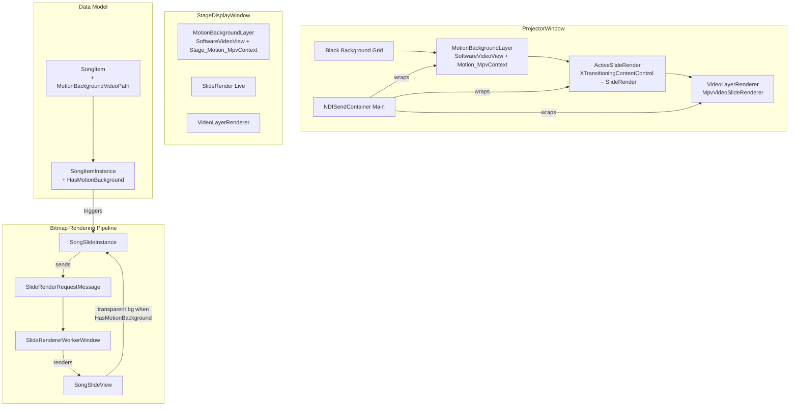

# Design Document: Motion Backgrounds

## Overview

Motion Backgrounds introduces a looping video background layer that renders beneath song lyrics in the projector and stage display outputs. The feature adds a new compositing layer to the rendering pipeline, a dedicated LibMPV playback context, transparent bitmap rendering for song slides, and a configuration property on SongItem for associating a video file.

The design integrates with the existing layer compositing architecture by inserting a new `MotionBackgroundLayer` control beneath the `ActiveSlideRender` in both ProjectorWindow and StageDisplayWindow. It leverages the existing `SoftwareVideoView` and `MpvContext` infrastructure but creates independent instances to avoid conflicts with the video slide playback singleton.

### Key Design Decisions

1. **Separate MpvContext per output window** — Each window (Projector, Stage Display) gets its own `Motion_MpvContext` to ensure independent playback and avoid shared-state issues between windows that may render at different rates.

2. **Layer insertion via AXAML Grid stacking** — The motion background is a sibling control in the same Grid as `ActiveSlideRender`, placed before it in document order (lower Z-index), matching the existing pattern used by `VideoLayerRenderer` (which sits above).

3. **Transparent bitmap rendering controlled by a flag on SongSlideInstance** — Rather than modifying `BaseSlideTheme`, the `SongSlideView` template conditionally renders a transparent background when the parent `SongItemInstance` has a motion background configured. This keeps the theme model clean and avoids side effects on other uses of the theme.

4. **Reactive item-change detection** — The motion background layer observes `Playlist.SelectedItem` changes via ReactiveUI bindings to start/stop video playback, matching the existing reactive patterns throughout the codebase.

5. **Opacity-based fade transitions** — The MotionBackgroundLayer uses Avalonia's `Opacity` property animated via a `DoubleTransition` to fade in/out. This integrates naturally with the compositing stack (the layer is always present in the Grid, just transparent when inactive) and avoids complex frame-level blending in the video pipeline.

## Architecture



### Compositing Order (back to front)

| Z-Order | Layer | Content |
|---------|-------|---------|
| 0 | Black Background | Solid black fallback |
| 1 | MotionBackgroundLayer | Looping video (or transparent when inactive) |
| 2 | ActiveSlideRender | Song slide bitmaps (transparent bg) / other slides |
| 3 | VideoLayerRenderer | Video slide playback (existing) |

### NDI Output Inclusion

| NDI Output | Includes Motion BG? |
|------------|---------------------|
| Main Output | Yes — MotionBackgroundLayer is inside the NDISendContainer |
| Lyrics-Only Output | No — uses AltSlideRenderer which is outside the main composite |

## Components and Interfaces

### 1. MotionBackgroundLayer (New UserControl)

**Location:** `HandsLiftedApp.Core/Render/MotionBackground/MotionBackgroundLayer.axaml(.cs)`

A UserControl that hosts a `SoftwareVideoView` and manages a dedicated `MpvContext` for motion background playback.

```csharp
public partial class MotionBackgroundLayer : UserControl, IDisposable
{
    // Avalonia Direct Property for binding the active item
    public static readonly DirectProperty<MotionBackgroundLayer, Item?> ActiveItemProperty;
    public Item? ActiveItem { get; set; }

    private MpvContext? _motionMpvContext;
    private SoftwareVideoView? _videoView;
    private string? _currentVideoPath;

    // Fade configuration
    public TimeSpan FadeInDuration { get; set; } = TimeSpan.FromMilliseconds(500);
    public TimeSpan FadeOutDuration { get; set; } = TimeSpan.FromMilliseconds(500);

    // Lifecycle
    public void StartPlayback(string videoFilePath);
    public void StopPlayback();
    public void FadeIn();
    public void FadeOut(Action? onComplete = null);
    public void Dispose();
}
```

**Responsibilities:**
- Creates and configures a dedicated `MpvContext` with `vo=libmpv`, `force-window=no`, `loop-file=inf`
- Observes `ActiveItem` property changes to detect when a SongItemInstance with a motion background becomes active
- Starts video playback via `loadfile` command when a motion background is configured
- Fades in (Opacity 0→1) once the first frame is decoded and ready to render
- Fades out (Opacity 1→0) when the active item changes, then stops playback after the fade completes
- Disposes the `MpvContext` on detach or application shutdown
- Scales video to fill 1920×1080 using `UniformToFill` stretch on the SoftwareVideoView

**AXAML Template:**
```xml
<UserControl x:Class="HandsLiftedApp.Core.Render.MotionBackground.MotionBackgroundLayer"
             Width="1920" Height="1080"
             Opacity="0">
    <UserControl.Transitions>
        <Transitions>
            <DoubleTransition Property="Opacity" Duration="0:0:0.5" Easing="CubicEaseInOut" />
        </Transitions>
    </UserControl.Transitions>
    <libmpv:SoftwareVideoView x:Name="VideoView"
                               Stretch="UniformToFill"
                               RenderOptions.BitmapInterpolationMode="HighQuality" />
</UserControl>
```

**Fade Transition Behaviour:**
- On activation: Start playback → wait for first frame callback → set `Opacity = 1` (triggers animated transition)
- On deactivation: Set `Opacity = 0` (triggers animated transition) → on transition complete, stop playback and release resources
- On item-to-item transition (both have motion BG): Fade out → stop old video → load new video → fade in

### 2. MotionBackgroundService (New Static/Singleton Service)

**Location:** `HandsLiftedApp.Core/Services/MotionBackgroundService.cs`

Encapsulates MpvContext lifecycle management for motion backgrounds. Each `MotionBackgroundLayer` instance calls into this service to create its own context.

```csharp
public static class MotionBackgroundService
{
    public static MpvContext? CreateMotionMpvContext();
    public static void DisposeContext(ref MpvContext? context);
    public static bool IsValidVideoFile(string? filePath);
    public static string? ResolveVideoPath(string? relativePath, string? playlistDirectory);
}
```

**Responsibilities:**
- Factory method for creating properly configured MpvContext instances
- Validates video file extensions (.mp4, .mov, .avi, .wmv, .mkv, .webm)
- Resolves relative paths against playlist directory
- Handles initialization failures gracefully with logging

### 3. Modified: SongSlideView (Existing)

**Location:** `HandsLiftedApp.Core/Views/Designer/SongSlideView.axaml`

Modified to conditionally render a transparent background when the parent SongItemInstance has a motion background configured.

**Change:** The Grid background and Border ImageBrush become conditional:
- When `HasMotionBackground` is true → Background is `Transparent`, ImageBrush is null
- When `HasMotionBackground` is false → Existing behaviour (theme colour + image)

### 4. Modified: SongItemInstance (Existing)

**Location:** `HandsLiftedApp.Core/Models/RuntimeData/Items/SongItemInstance.cs`

Adds a computed `HasMotionBackground` property derived from the `MotionBackgroundVideoPath`.

```csharp
// New property
[XmlIgnore]
public bool HasMotionBackground => !string.IsNullOrWhiteSpace(MotionBackgroundVideoPath);
```

### 5. Modified: SongItem (Existing Data Model)

**Location:** `HandsLiftedApp.Data/Models/Items/SongItem.cs`

Adds the serializable `MotionBackgroundVideoPath` property.

```csharp
private string? _motionBackgroundVideoPath;

public string? MotionBackgroundVideoPath
{
    get => _motionBackgroundVideoPath;
    set => this.RaiseAndSetIfChanged(ref _motionBackgroundVideoPath, value);
}
```

### 6. Modified: ProjectorWindow.axaml (Existing)

Inserts `MotionBackgroundLayer` into the NDISendContainer Grid, before `ActiveSlideRender`:

```xml
<Grid>
    <motionBg:MotionBackgroundLayer ActiveItem="{Binding Playlist.SelectedItem}" />
    <render:ActiveSlideRender ActiveSlide="{Binding Playlist.ActiveSlide}" />
    <videoLayer:VideoLayerRenderer DataContext="{Binding Playlist.ActiveSlide}" />
</Grid>
```

### 7. Modified: DefaultLayout.axaml (Stage Display)

Same pattern — inserts `MotionBackgroundLayer` before `SlideRender` in the Live preview Grid.

### 8. Modified: HandsLiftedDocXmlSerializer (Existing)

Updates `SerializeItem` for `SongItemInstance` to include `MotionBackgroundVideoPath` (converted to relative path). Updates deserialization to resolve relative path back to absolute.

### 9. Modified: SlideRendererWorkerWindow (Existing)

No code changes needed — the `SongSlideView` template handles transparency based on the `SongSlideInstance.HasMotionBackground` binding. The worker window renders whatever the template produces.

## Data Models

### SongItem (Modified)

```csharp
[XmlRoot("Song", Namespace = Constants.Namespace, IsNullable = false)]
[Serializable]
public class SongItem : Item
{
    // ... existing properties ...

    // NEW: Motion background video file path (relative when serialized)
    private string? _motionBackgroundVideoPath;
    public string? MotionBackgroundVideoPath
    {
        get => _motionBackgroundVideoPath;
        set => this.RaiseAndSetIfChanged(ref _motionBackgroundVideoPath, value);
    }
}
```

### SongItemInstance (Modified)

```csharp
public class SongItemInstance : SongItem, IItemInstance, IItemDirtyBit
{
    // ... existing properties ...

    // NEW: Computed property for motion background availability
    [XmlIgnore]
    public bool HasMotionBackground =>
        !string.IsNullOrWhiteSpace(MotionBackgroundVideoPath)
        && MotionBackgroundService.IsValidVideoFile(MotionBackgroundVideoPath);

    // Raises HasMotionBackground change when path changes
    // Triggers bitmap regeneration for all slides
}
```

### SongSlideInstance (Modified)

```csharp
public class SongSlideInstance : SongSlide, ISlideInstance
{
    // ... existing properties ...

    // NEW: Exposes parent's motion background state for template binding
    [XmlIgnore]
    public bool HasMotionBackground => ParentSongItem?.HasMotionBackground ?? false;
}
```

### Serialization Format (XML)

```xml
<Song xmlns="http://schemas.handslifted.com">
    <Title>Amazing Grace</Title>
    <MotionBackgroundVideoPath>Backgrounds\worship-loop-01.mp4</MotionBackgroundVideoPath>
    <!-- ... existing elements ... -->
</Song>
```

The path is stored relative to the playlist file directory. On load, it is resolved to an absolute path using `RelativeFilePathResolver.ToAbsolutePath()`.

### MpvContext Configuration

| Property | Value | Purpose |
|----------|-------|---------|
| `vo` | `libmpv` | Software rendering to bitmap |
| `force-window` | `no` | No OS window created |
| `loop-file` | `inf` | Seamless infinite looping |
| `video-sync` | `display-resample` | Smooth frame timing |
| `aid` | `no` | Disable audio track |
| `mute` | `yes` | Ensure no audio output |


## Correctness Properties

*A property is a characteristic or behavior that should hold true across all valid executions of a system — essentially, a formal statement about what the system should do. Properties serve as the bridge between human-readable specifications and machine-verifiable correctness guarantees.*

### Property 1: Transparency compositing correctness

*For any* song slide bitmap rendered with `HasMotionBackground = true`, and *for any* pixel position in the background region (outside rendered text glyphs), the alpha channel value at that position SHALL be 0 (fully transparent), allowing the motion background layer beneath to be visible through compositing.

**Validates: Requirements 1.3, 4.1**

### Property 2: Motion background transition on item change

*For any* two consecutive SongItemInstances where both have a configured `MotionBackgroundVideoPath`, when the active item changes from the first to the second, the MotionBackgroundLayer SHALL fade out the previous video, issue a stop command, then issue a loadfile command for the new video path and fade in, without requiring manual intervention.

**Validates: Requirements 1.7, 2.6**

### Property 3: Slide navigation does not restart playback

*For any* SongItemInstance with a configured motion background and *for any* sequence of `SelectedSlideIndex` changes that remain within the bounds of that item's slide collection, the MotionBackgroundLayer SHALL NOT issue a loadfile or stop command to the Motion_MpvContext during those navigations.

**Validates: Requirements 2.3**

### Property 4: Previous video fades out on any item change

*For any* SongItemInstance with a configured motion background that is currently active, when *any* different item (with or without a motion background) becomes the active item, the MotionBackgroundLayer SHALL animate Opacity from 1 to 0 and then issue a stop command to the Motion_MpvContext.

**Validates: Requirements 2.5, 2.7**

### Property 5: MpvContext independence

*For any* command issued to the Motion_MpvContext (loadfile, stop, pause, seek), the `Globals.Instance.MpvContextInstance` singleton's observable properties (time-pos, pause, loaded file path) SHALL remain unchanged, and vice versa.

**Validates: Requirements 3.2**

### Property 6: Bitmap background determined by HasMotionBackground

*For any* SongSlideInstance, if `HasMotionBackground` is true then the rendered bitmap SHALL have a transparent background (alpha = 0 for background pixels), and if `HasMotionBackground` is false then the rendered bitmap SHALL have background pixels matching the theme's `BackgroundColour`.

**Validates: Requirements 4.1, 4.2**

### Property 7: Bitmap regeneration on motion background addition

*For any* SongItemInstance with N slides (N ≥ 1), when `MotionBackgroundVideoPath` is set from null/empty to a valid path, the system SHALL emit exactly N `SlideRenderRequestMessage` instances (one per SongSlideInstance belonging to that item).

**Validates: Requirements 4.4**

### Property 8: Video path validation

*For any* string that is null, empty, or a file path ending in a supported extension (.mp4, .mov, .avi, .wmv, .mkv, .webm), `IsValidVideoFile` SHALL return true only for non-null, non-empty paths with a supported extension. *For any* path with an unsupported extension or null/empty value, it SHALL return false.

**Validates: Requirements 5.1, 5.2**

### Property 9: Path serialization round-trip

*For any* absolute video file path and *for any* valid playlist directory path, converting the absolute path to a relative path (via `RelativeFilePathResolver.ToRelativePath`) and then resolving it back (via `RelativeFilePathResolver.ToAbsolutePath`) SHALL produce a path equivalent to the original absolute path.

**Validates: Requirements 5.5, 5.6**

### Property 10: Error resilience — no unhandled exceptions

*For any* invalid video file path (non-existent file, unsupported format, null, empty, or path exceeding 260 characters), activating a SongItem with that path SHALL NOT throw an unhandled exception, display an error dialog, or interrupt the presentation output. The MotionBackgroundLayer SHALL render as transparent.

**Validates: Requirements 6.4**

## Error Handling

### Video File Errors

| Error Condition | Behaviour | Logging |
|----------------|-----------|---------|
| File path is null/empty | Layer renders transparent, no playback attempted | None (normal state) |
| File does not exist on disk | Layer renders transparent | `Log.Warning` with file path |
| File exists but cannot be decoded | Layer renders transparent, stop playback | `Log.Error` with file path and MPV error |
| File becomes unreadable during playback | Stop playback, render transparent | `Log.Warning` with file path |
| Unsupported file extension | Layer renders transparent, no playback attempted | `Log.Warning` with file path |

### MpvContext Errors

| Error Condition | Behaviour | Logging |
|----------------|-----------|---------|
| MpvContext fails to initialize | MotionBackgroundLayer disabled for session, app continues | `Log.Error` with exception |
| MpvContext command throws MpvException | Catch, stop playback, render transparent | `Log.Error` with command and exception |
| MpvContext disposal fails | Catch exception, null the reference | `Log.Error` with exception |

### Design Principles

1. **Never interrupt the presentation** — All errors are caught and logged. The layer degrades to transparent, allowing the content layer to show with its standard theme background.
2. **No error dialogs** — During a live service, modal dialogs are unacceptable. All feedback is via logging.
3. **Graceful degradation** — If motion background fails, the slide renders with its theme background as if no motion background was configured.
4. **Resource cleanup** — On any error, ensure the MpvContext is stopped and resources are released to prevent memory leaks.

## Testing Strategy

### Unit Tests (Example-Based)

| Test | Validates |
|------|-----------|
| MotionBackgroundLayer is invisible when ActiveItem has no motion background | Req 1.4 |
| Grid compositing order: MotionBG → ActiveSlide → VideoLayer | Req 1.1, 1.2, 1.5 |
| SoftwareVideoView uses UniformToFill stretch | Req 1.6 |
| MpvContext is not the global singleton | Req 3.1 |
| MpvContext configured with vo=libmpv, force-window=no, loop-file=inf | Req 3.3 |
| MpvContext disposed on deactivation | Req 3.4 |
| MpvContext init failure logs and continues | Req 3.5 |
| Deferred regeneration on config removal | Req 4.3 |
| Pixel format supports alpha channel | Req 4.5 |
| Null/empty path → HasMotionBackground is false | Req 5.3 |
| Invalid path falls back to standard rendering | Req 5.4 |
| Missing file logs warning with path | Req 6.1 |
| Undecodable file logs error with path and reason | Req 6.2 |
| File unreadable during playback → graceful stop | Req 6.3 |
| NDI lyrics-only does not include motion background | Req 7.2 |
| Stage Display uses independent MpvContext | Req 7.4 |

### Property-Based Tests

**Library:** [FsCheck](https://fscheck.github.io/FsCheck/) (via FsCheck.Xunit for .NET)

**Configuration:** Minimum 100 iterations per property test.

Each property test references its design document property via tag comment:
```
// Feature: motion-backgrounds, Property {N}: {property_text}
```

| Property Test | Design Property | Key Generators |
|---------------|-----------------|----------------|
| Transparent bitmap background pixels | Property 1, 6 | Random theme colours, font sizes, text content |
| Motion background transition commands | Property 2 | Pairs of random valid video paths |
| Slide navigation continuity | Property 3 | Random slide index sequences within bounds |
| Fade out on item change | Property 4 | Random SongItems followed by random other items |
| MpvContext command isolation | Property 5 | Random MPV command sequences |
| Bitmap regeneration count | Property 7 | Random SongItems with 1-20 slides |
| Video path validation | Property 8 | Random strings, valid/invalid extensions |
| Path serialization round-trip | Property 9 | Random absolute paths + playlist directories |
| Error resilience | Property 10 | Random invalid paths (null, empty, >260 chars, bad extensions) |

### Integration Tests

| Test | Validates |
|------|-----------|
| NDI main output frame contains motion background pixels | Req 7.1 |
| Stage Display renders motion background beneath content | Req 7.3 |
| Opacity animates from 0 to 1 on activation (fade in) | Req 2.2 |
| Opacity animates from 1 to 0 on deactivation (fade out) | Req 2.5 |
| Video loops seamlessly (no black frames between loops) | Req 2.3 |
